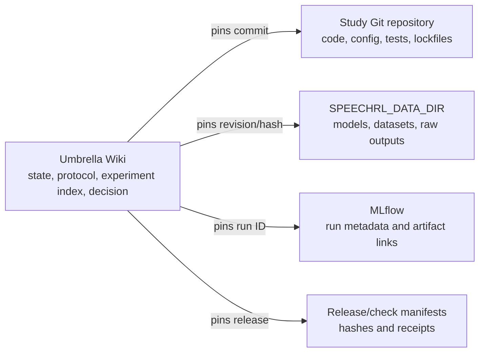

# Workspace architecture

## Repository ownership

This workspace uses three repository classes:

1. **Umbrella governance repository** (`exploring-l4-intelligence`) — owns the thesis, current state,
   Wiki, study/paper registries, shared utilities, data/model acquisition, integrity manifests and
   cross-study checks. Every new topic's Stage‑1 discussion/survey runs here.
2. **Study repositories** (`studies/<semantic-slug>/`) — independent GitHub repositories created only
   after a research object receives owner GO and an execution contract; Stage‑2 work lives there and
   ends at one or more qualified paper candidates.
3. **Paper repositories** (`papers/<semantic-slug>/`) — independent GitHub repositories admitted only
   by promotion from a qualified study candidate under `OWNER_GO_AND_PAPER_EXECUTION_CONTRACT`
   (Decision-Log continuation entry 91; none admitted yet). Stage‑3 work — large-scale pre-registered confirmatory
   experiments, final evidence, manuscripts and publication releases — lives there, never in a study
   repository.

The historical W1–W4 work repositories were retired on 2026-08-03 (local checkouts deleted, remotes
kept as cold backups; tombstone `wiki/archive/program/w1-w4-retirement/`).

Candidate labels used during direction analysis are not repository identities. R1, for example, sunset
before admission and has no engineering repository. A later study is named by the research question
frozen in its execution contract, not by an R-number.

## Local topology

```text
exploring-l4-intelligence/          umbrella Git repository
├── common/                         stable cross-study Python utilities
├── studies/
│   ├── README.md                   umbrella-tracked admission policy
│   ├── registry.json               umbrella-tracked admitted-study registry
│   └── <semantic-slug>/            independent study Git repository (Stage‑2)
├── papers/
│   ├── README.md                   umbrella-tracked promotion policy
│   ├── registry.json               umbrella-tracked admitted-paper registry
│   └── <semantic-slug>/            independent paper Git repository (Stage‑3; none yet)
├── wiki/                           program and experiment management truth
├── docs/                           design, integrity and reproducibility assets
├── scripts/                        executable governance and environment tooling
└── speechrl-data/                  external, gitignored large-asset root
```

The umbrella ignores `studies/*/` and `papers/*/`. It tracks the top-level README/registry pairs,
but never the nested study or paper code.

## Experiment asset architecture

The umbrella Wiki is the management plane. Each study Git repository is an execution plane.
`SPEECHRL_DATA_DIR` and MLflow are the artifact/run planes.



The current experiment-asset contract and legacy inventory resolution are in
`wiki/Experiment-Assets.md` and `docs/integrity/experiment-asset-inventory.json`.

## Direction-local pipeline

Each research object advances independently:

```text
survey → owner decision → semantic identity + execution contract → study repo (Stage‑2)
    → qualified paper candidate → OWNER_GO_AND_PAPER_EXECUTION_CONTRACT
    → paper repo (Stage‑3) → pre-registered confirmatory → publication | closed-negative
```

Engineering for one admitted study can overlap the survey of the next candidate. There is no requirement
to finish all candidate-direction surveys before one admitted study enters Stage-2. Integration is a
later research object, not a directory hierarchy imposed on every study.
